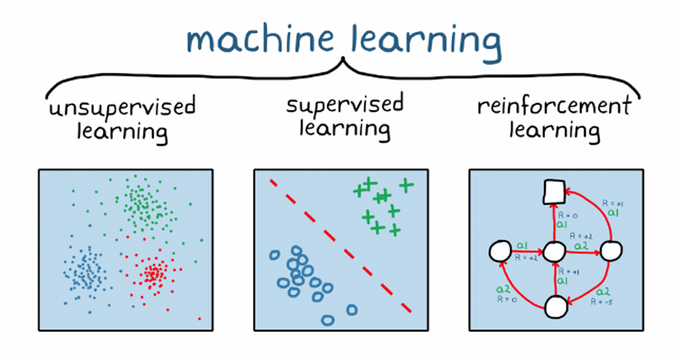
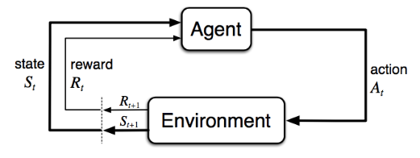

$$
\newcommand{\msf}[1]{\mathsf{#1}}
\newcommand{\mbf}[1]{\mathbf{#1}}
\newcommand{\trop}{\msf{T}}
\newcommand{\polop}{\msf{P}}
\newcommand{\pol}{\pi}
\newcommand{\spX}{\mathcal{X}}
\newcommand{\spA}{\mathcal{A}}
\newcommand{\spOm}{\Omega}
\newcommand{\scal}[2]{\left\langle{#1},{#2}\right\rangle}
\newcommand{\norb}[1]{\bigl\|{#1}\bigr\|}
\newcommand{\nor}[1]{\left\|{#1}\right\|}
\newcommand{\Cb}[1]{C_{b}(#1)}
\newcommand{\Bb}[1]{B_{b}(#1)}
\newcommand{\spM}[1]{\mathcal{M}(#1)}
\newcommand{\EE}{\mathbb E}
\newcommand{\PP}{\mathbb P}
\newcommand{\R}{\mathbb{R}}
\newcommand{\Id}{\msf{Id}}
\def\sc#1{\dosc#1\csod} \def\dosc#1#2\csod{{\rm #1{\small #2}}}
$$

# Operator World Models for Reinforcement Learning
P. Novelli, M.Pratticò, M.Pontil, and C. Ciliberto

---

# What is Reinforcement Learning?

- A class of algorithms inspired by how people and animals learns to achieve goals
- People and animals learn by __interacting with the environment__
- This differs from other types of learning
  - It is __active__ rather then passive
  - Interactions are often __sequential__ - future interactions can depend on earlier ones
- We are __goal-directed__
- We learn optimising some __reward signal__
---
# What is Reinforcement Learning?

- Reinforcement Learning doesn't work with a static dataset and it gets data from the __experience__

---
# The interaction Loop

__Goal__ : optimise sum of rewards, through repeated interaction

---

# Formalizing the RL problem

- At each step $t$ the agent:
  - Receives the Observation $X_t$ (and reward $R_t$)
  - Executes an action $A_t$
- The environment:
  - Receives Action $A_t$
  - Emits observation $X_{t+1}$ (and reward $R_{t+1}$)

---
# The Policy

- A __policy__ defines the agent's behaviour
- It is a map from agent state to action
- The policy can be:
  - __Deterministic__: $A = \pi(X)$
  - __Stochastic__: $\pi(A|X) = \mathbb{P}(A|X)$

---

# The Reward 

- A __reward__ $R_t$ is a scalar feedback signal
- It indicates how well the agent is doing at a step $t$ - defines a goal
- The agent's job is to maximize comulative reward
$$J(\pol) = \EE\left[\sum_{t=0}^{\infty} \gamma^t r(X_t,A_t)\right]$$
- We introduced a __discount factor__ $\gamma \in (0,1)$
    - Trades off: importance of immediate vs long-term rewards

---

# The Reward Hypothesis

Reinforcement Learning is based on the __Reward Hypothesis__:
_Any goal can be formalized as the outcome of maximizing a cumulative reward_

---
# Value Function and Action values
---

# Value Function

- The value function is defined as the expected return
$$ V_\pi(x) = \EE\left[\sum_{t=0}^{\infty} \gamma^t r(X_t,A_t) \Big\vert X_0 = x \right] $$

- The value depends on a policy
- Can be used to evaluate the desiderability of states
- Can be used to select between actions

---

# Action-Value Function

- Similarly, we can define the action-value function (Q-function) as 
$$ Q_\pi(x,a) = \EE\left[\sum_{t=0}^{\infty} \gamma^t r(X_t,A_t) \Big\vert X_0 = x, A_0 = a \right] $$
- This function is strongly related to the value function, and:
$$ V_\pi(x) = \EE\left[Q_\pi(X_t, A_t) \Big\vert X_t = x, A_t \thicksim  \pi(X_t) \right] $$

---
# Markov Decision Process 

- Almost all RL problems can be framed as __Markov Decision Processes__
- All states in MDP has __Markov__ property $\rightarrow$ the future and the past are conditionally independent given the present
  - The future only depends on the current state, not on the history

---
# Markov Decision Process and the RL objective

Markov Decision Process over state space $\spX$, and (finite) action space $\spA$.
We aim to maximize the objective
$$J(\pol) = \EE\left[\sum_{t=0}^{\infty} \gamma^t r(X_t,A_t)\right],$$
where 
- $X_{0} \sim \nu$ initial distribution.
- $A_{t} \sim \pol(\cdot | X_{t})$ policy.
- $X_{t + 1} \sim \tau(\cdot | X_{t}, A_{t})$ transition kernel.
- $r:\spX \times \spA \to \R$ reward function.
- $\gamma \in (0, 1)$ discount factor.
---
# The tutorial will resume shortly 

<video src="figs/video.mp4" style="width: 70%" autoplay controls></video>

---
# Reinforcement learning

In RL we want to maximize $J(\pol)$, **without knowing** the transition kernel $\tau$ and reward function $r(X_{t}, A_{t})$ explicitly.
### Two problems to be solved concurrently
1. Policy Optimization
2. Learning from the interaction with the environment

---
# The operator way

Instead of working with probabilities, we use **conditional expectation operators**.

- *Transition operator* $\trop$ associated to $\tau$. 
$$(\trop f)(x, a) = \int_\spX f(x')~\tau(dx'|x,a) = \EE\left[f(X')\mid x, a\right]$$

- *Policy operator* $\polop$ associated to $\pol$

$$(\polop_\pol g)(x) = \int_\spA g(x, a)~\pol(da | x)= \EE\left[g(X,A)\mid X = x\right]$$

With $f,g$ belonging to appropriate spaces of (bounded) functions.

---
# Reformulating RL with operators
The expected reward after a single interaction between a policy $\pol$ and the MDP as
$$(\trop\polop_\pol r)(x,a)=\EE[r(X',A')|X_0=x,A_0=a]$$

This identity can be applied recursively, yielding the *action-value function* as

$$q_\pol(x,a) = \sum_{t=0}^{\infty} \gamma^t \EE[r(X_t,A_t)|X_0=x,A_0=a] = \sum_{t=0}^{\infty} (\gamma \trop \polop_\pol)^t r = {\color{yellow}(\Id - \gamma\trop\polop_\pol)^{-1}r}$$

---
# Why bothering?
- __Efficiency__: Given a dataset $(x_{i}, a_{i}, x'_{i}, r_{i})_{i = 1}^{T}$, the operator $\trop$ can be _learned from data_ via Conditional Mean Embeddings (CMEs)
- __Simplicity__: Combining CMEs with standard scalar regression for the reward $r$ we estimate the action value function $q_{\pol}$ _in closed form via matrix operations_.
- __No extra sampling__: CMEs estimate expectations without any additional sampling and incur only in model error, for which learning bounds are available.

---
# Our algorithm: POWR
## Policy mirror descent wit Operator World models for RL
1. __Exploration__: Estimate $\trop$ and $r$ from data using CMEs. Combine them to get an approximation of the action value function $\hat{q}_{\pol}$.
2. __Planning__: Compute the mirror descent update $\pol_{t + 1}(\cdot | x) = {\sc{SOFTMAX}} \left(\log(\pol_{0}(\cdot |x)) + \eta\sum_{s = 0}^{t} \hat{q}_{\pol_{s}}(x, \cdot)\right)$

--- 
# POWR converges to the global optimum.
## Theorem (informal)
Let $(\pol_{t})_{t \in \mathbb{N}}$ be a sequence of policies generated by POWR. If the action-value functions $\hat{q}_{\pol_{t}}$ are estimated from a dataset $(x_{i}, a_{i}; x_{i}')_{i = 1}^{n}$ with $(x_{i}, a_{i}) \sim \rho \in \mathcal{P}(\spOm)$, the iterates converge to the optimal policy as 
$$
    J(\pol_{*}) - J(\pol_{T}) \leq O\left(\frac{1}{T} + \delta^{2} n^{-\alpha}\right)
$$
with probability not less than $1 - 4e^{-\delta}$ and $\alpha < 1$. Here and $\pol_{*}:\spX \to \Delta(\spA)$ is a measurable maximizer of $J$.

---
# Experimental results
## `https://github.com/CSML-IIT-UCL/powr`